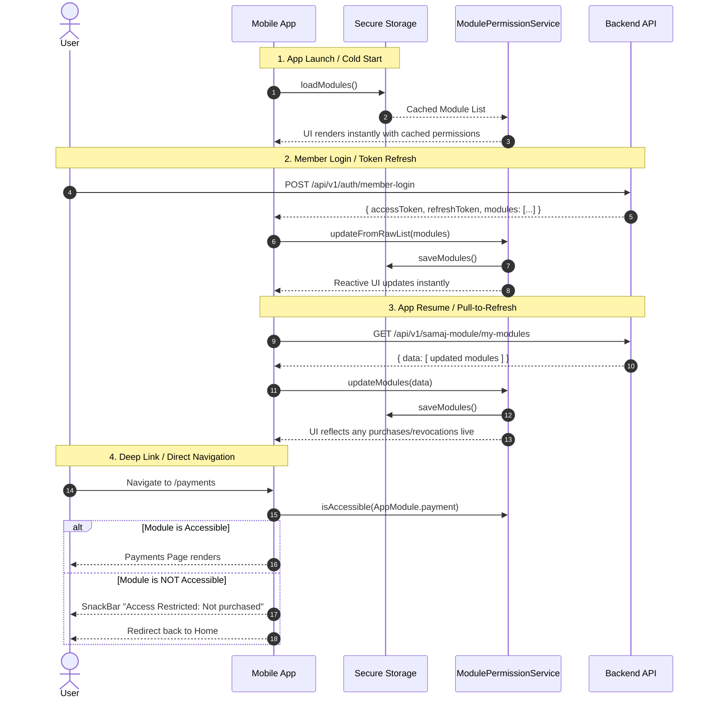

# Module Permission System (Mobile App)

Is directory (`lib/core/module_permission/`) ke andar mobile application ka **Production-Level Module Permission System** implement kiya gaya hai, jo backend API documentation (`module-permission-api-documentation.md`) ke mutabiq kaam karta hai.

---

## 1. Kyu Banaya Gaya? (Motivation & Problem Solved)

Har Samaj apne purchase ke mutabiq alag-alag modules khareedta hai (jaise: `PAYMENT`, `MATRIMONIAL`, `OCCUPATION`, `EVENT`, `DAILY_NOTIFICATION`).
- Agar Samaj ne **Payment** module nahi khareeda ya module expire ho gaya, toh app me Payment ke menus, tabs aur buttons nahi dikhne chahiye.
- Agar user deep link ya kisi URL se zabardasti access karne ki koshish kare, toh backend `403 Forbidden` deta hai. Mobile app me route-level guard hona chahiye jo screen load hone se pehle hi check kare aur user ko warning show kare.
- Login, Refresh Token aur App Open/Pull-to-refresh pe bina re-login karwaye permissions background me sync honi chahiye.
- App restart hone par permissions gayab na ho, isliye encrypted secure storage me caching zaruri hai.

---

## 2. Directory Structure

```
lib/core/module_permission/
│
├── models/
│   ├── app_module.dart             # Strongly-typed enum (PAYMENT, MATRIMONIAL, etc.)
│   └── module_permission_model.dart # Backend response model with full JSON serialization
│
├── storage/
│   └── module_permission_storage.dart # Encrypted secure storage cache using SecureStorageService
│
├── services/
│   └── module_permission_service.dart # Central reactive GetX service for permissions & API sync
│
├── guards/
│   └── module_guard.dart           # Route middleware (GetMiddleware) for deep link & route protection
│
├── widgets/
│   └── module_permission_gate.dart # Declarative UI widgets (Gate & Builder) for conditional rendering
│
├── module_permission.dart          # Barrel export file (single clean import)
└── README.md                       # Complete documentation & developer guide
```

---

## 3. Detailed Component Breakdown

### A. `AppModule` Enum (`models/app_module.dart`)
Backend dwara define kiye gaye 5 standard module codes ko represent karta hai:
- `AppModule.payment` -> `'PAYMENT'`
- `AppModule.matrimonial` -> `'MATRIMONIAL'`
- `AppModule.occupation` -> `'OCCUPATION'`
- `AppModule.event` -> `'EVENT'`
- `AppModule.dailyNotification` -> `'DAILY_NOTIFICATION'`

**Key Utility Methods:**
- `AppModule.fromCode(String? code)`: Case-insensitive and trimmed lookup.
- `module.matches(String? otherCode)`: Quick equality check against string codes.

---

### B. `ModulePermissionModel` (`models/module_permission_model.dart`)
Backend ke standard module object se 100% align karta hai:
```json
{
  "moduleId": 1,
  "code": "PAYMENT",
  "name": "Payment",
  "description": "...",
  "sortOrder": 1,
  "isEnabled": true,
  "isAccessible": true,
  "validFrom": "2026-09-08T00:00:00",
  "validTo": "2027-09-08T00:00:00",
  "remarks": null,
  "samajModuleId": 12
}
```
- **`isAccessible`**: Yeh field primary rule hai. Documentation ke mutabiq:
  > *"Use `isAccessible` for UI. `true` = show the module. Ignore a module when that flag is `false`."*
- `appModule`: Getter jo strongly-typed `AppModule` enum return karta hai.

---

### C. `ModulePermissionStorage` (`storage/module_permission_storage.dart`)
- User ki device me permissions ko `SecureStorageService` ke zariye save karta hai.
- App cold start (restart) par permissions zero latency me available hoti hai bina API call ke wait kiye.

---

### D. `ModulePermissionService` (`services/module_permission_service.dart`)
Central reactive service jo GetX me permanent register hoti hai:
- `ModulePermissionService.to.isAccessible(AppModule.payment)` -> O(1) instantaneous check.
- `ModulePermissionService.to.canUse(AppModule.payment)` -> Doc specification alias.
- `modules` (RxList) & `_moduleMap` (RxMap): Reactive state variables jo UI ko instantly update karte hain.
- `updateFromRawList(dynamic rawList)`: Login aur Refresh token ke responses me se raw JSON list ko parse aur save karta hai.
- `fetchMyModules({bool silent = true})`: Backend endpoint `/api/v1/samaj-module/my-modules` ko call karta hai (App resume ya Pull-to-refresh par).
- `clear()`: Logout par in-memory aur secure storage dono ko clean karta hai.

---

### E. `ModuleGuard` (`guards/module_guard.dart`)
GetX `GetMiddleware` implementation:
- Routes jaise `/payments`, `/marriage`, `/occupation-directory`, `/notifications` par laga hua hai.
- Agar koi user deep link se ya direct route call kare aur module Samaj ke paas na ho, toh yeh redirection karta hai aur screen load hone se pehle user ko error notification show karta hai:
  > *"Access Restricted: This Samaj has not purchased the PAYMENT module."*

---

### F. Declarative Widgets (`widgets/module_permission_gate.dart`)
Agar kisi page ke andar koi specific button, card ya banner module-dependent ho:
```dart
ModulePermissionGate(
  module: AppModule.payment,
  child: PayNowButton(),
  fallback: SizedBox.shrink(), // optional
)
```

---

## 4. Kya Changes Kiye Gaye Aur Kyu? (What & Why)

| File | Change | Reason |
| :--- | :--- | :--- |
| `lib/core/network/api_endpoints.dart` | Added `static String myModules = '/api/v1/samaj-module/my-modules';` | Section 9 API endpoint for module sync without re-login. |
| `lib/core/constants/di.dart` | Registered `ModulePermissionStorage` & `ModulePermissionService` in `bootstrap()` | Dependency injection setup so permission service is ready before UI renders. |
| `lib/core/models/auth_tokens.dart` | Updated `Modules` typedef to `ModulePermissionModel` | Upgrades auth token model to full feature parity while maintaining 100% backwards compatibility. |
| `lib/features/auth/repositories/auth_repository_impl.dart` | In `login()`, `memberLogin()`, and `memberRefreshToken()` mapped `rawModules` into `_moduleService.updateFromRawList(...)` | Login aur refresh token API responses se permission state sync rakhne ke liye. |
| `lib/core/network/auth_interceptor.dart` | In `_refreshSingleFlight()` updated module permissions when background token refresh succeeds | Background token auto-refresh hone par bhi updated module permissions cache ho sake. |
| `lib/core/auth/auth_state.dart` | Added `ModulePermissionService.to.clear()` in `logout()` & `logoutAndRedirect()` | User logout hone par purane Samaj ki cached permissions wipe ho jaye. |
| `lib/features/home/controllers/home_controller.dart` | 1. Added `module` field to `MenuItem`.<br>2. Dynamic `menuItems` getter filtering via `ModulePermissionService`.<br>3. Check `AppModule.dailyNotification` before fetching unread notifications.<br>4. Call `fetchMyModules()` on `onInit()` and `didChangeAppLifecycleState()`. | Samaj purchase ke mutabiq dynamically Home menu cards show/hide karne ke liye, aur app open par silent module sync ke liye. |
| `lib/features/home/pages/home_page.dart` | 1. Wrapped `_HomeMenuGrid` in `Obx`.<br>2. Wrapped `_NotificationMenu` in `Obx` with `AppModule.dailyNotification` check.<br>3. Added `fetchMyModules()` inside `RefreshIndicator.onRefresh()`. | Pull-to-refresh karne par instant UI update, aur agar daily notification module na ho toh bell icon hide karne ke liye. |
| `lib/core/widgets/app_drawer.dart` | Wrapped `ListTile` of `LK.marriage.tr` in `Obx` checking `AppModule.matrimonial` | Drawer menu me se unauthorized features ko dynamically hide karne ke liye. |
| `lib/core/constants/app_router.dart` | Attached `ModuleGuard(...)` to payments, marriage, occupation, and notifications routes | Direct route transitions aur deep link navigation se unauthorized access rokne ke liye. |

---

## 5. Kaam Kaise Karta Hai? (Flow Diagram)



---

## 6. How to Use in Future Modules (Developer Guide)

### 1. Naya Module Add Karna:
`models/app_module.dart` me enum value add karein:
```dart
enum AppModule {
  payment('PAYMENT'),
  matrimonial('MATRIMONIAL'),
  occupation('OCCUPATION'),
  event('EVENT'),
  dailyNotification('DAILY_NOTIFICATION'),
  newFeature('NEW_FEATURE'); // <-- Naya module

  final String code;
  const AppModule(this.code);
}
```

### 2. UI Me Check Karna:
```dart
// Check in controller or build method:
final canAccess = ModulePermissionService.to.isAccessible(AppModule.newFeature);

// Ya declarative widget use karein:
ModulePermissionGate(
  module: AppModule.newFeature,
  child: NewFeatureWidget(),
)
```

### 3. Route Guard Lagana:
`lib/core/constants/app_router.dart` me:
```dart
GetPage<void>(
  name: '/new-feature',
  page: () => NewFeaturePage(),
  middlewares: [AuthGuard(), ModuleGuard(AppModule.newFeature)],
),
```

---

## 7. Quality Assurance
- **Null-Safety**: Poora code sound null safety ke sath likha gaya hai.
- **Error Resilient**: Agar backend se koi module array null ya corrupted aaye, app crash nahi hoti balki empty fallback handle karti hai.
- **Zero Overhead**: O(1) map indexing ki wajah se grid rendering me koi lag ya performance drop nahi aata.
